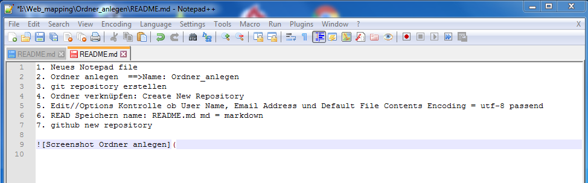

# 1. Neues Notepad file
2. Ordner anlegen  ==>Name: Ordner_anlegen
3. git repository erstellen
4. Ordner verknüpfen: Create New Repository
5. Edit//Options Kontrolle ob User Name, Email Address und Default File Contents Encoding = utf-8 passend
6. READ Speichern name: README.md md = markdown
7. github new repository
8. Git Gui/Remote/add/ neuer name + neuer link

Quelle: Screenshot Moritz Waas

